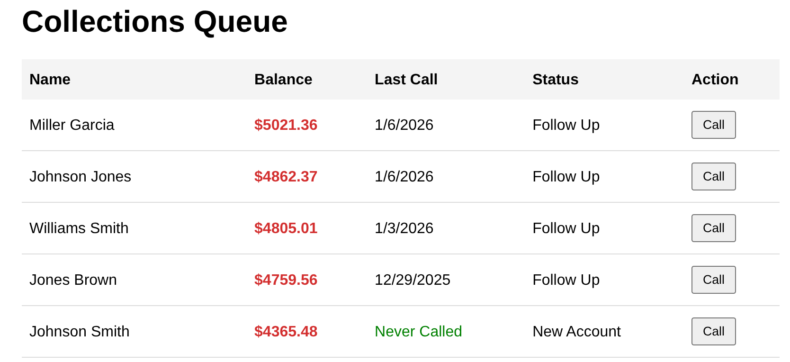
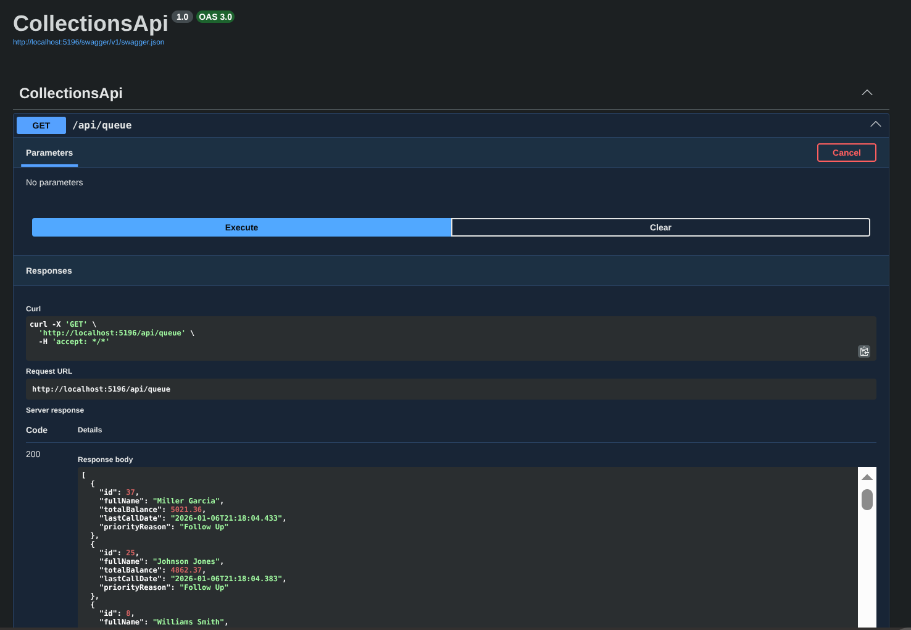

# Collections Queue Dashboard (PoC)

 

A full-stack **"Vertical Slice" Proof-of-Concept** for a high-volume financial collections system.

This project demonstrates a prioritized work queue focusing on **SQL performance (SARGable queries)**, **data integrity**, and **Optimistic UI patterns**. It was built to solve the specific problem of "delinquency interception" by reducing agent cognitive load and dashboard latency.

## 📸 The Vertical Slice

| **The UI (React 19)** | **The API (Swagger/OpenAPI)** |
|:---:|:---:|
|  |  |
| *Optimistic updates with "Undo" safety net* | *Minimal API with Dapper & SQL Server* |

---

## 🏗 Tech Stack & Architecture

* **Database:** MS SQL Server 2022 (Dockerized)
* **API:** .NET 9 Web API (Minimal API pattern)
* **ORM:** Dapper (Micro-ORM for raw SQL performance)
* **Frontend:** React 19 + TypeScript (Vite)
* **State:** React Hooks + Optimistic UI updates

## 🚀 Key Features & Engineering Decisions

### 1. Performance-First SQL (SARGable Queries)
The core logic resides in `sp_GetPriorityQueue`.
* **The Problem:** Typical `DATEDIFF` functions in `WHERE` clauses force full table scans.
* **The Fix:** I calculate the `@CutoffDate` variable *before* the lookup.
* **The Result:** The SQL engine performs an **Index Seek**, allowing the system to scale to millions of records without latency.

### 2. Vertical Slice Architecture
Instead of generic "Repository" and "Service" layers that create horizontal coupling, this app is built in **Vertical Slices**:
* **Read Slice:** `GET /api/queue` → Dapper Query → SQL Stored Proc
* **Write Slice:** `POST /api/queue/{id}/log` → Dapper Command → Parametrized SQL

### 3. Optimistic UI & Error Recovery
* **Instant Feedback:** The moment an agent logs a call, the item vanishes from the queue (client-side filter).
* **Safety Net:** An "Undo" Toast notification allows recovery from accidental clicks without a page reload.

---

## 📂 Project Structure

    CollectionsQueue-PoC/
    ├── api/                  # .NET 9 Backend
    │   ├── CollectionsApi/   # Web API Project
    │   └── sql/              # Database Setup Scripts (Schema & Seeds)
    ├── ui/                   # React 19 Frontend
    │   └── collections-ui/   # Vite Project
    └── docs/                 # Screenshots and documentation

---

## 🛠 How to Run Locally

### Prerequisites
* Docker Desktop
* .NET 9 SDK
* Node.js (LTS)

### 1. Database Setup
First, spin up the SQL Server container.
*(Note: You can change the password below, but ensure you update `appsettings.json` in the API project to match.)*

    docker run -e "ACCEPT_EULA=Y" -e "MSSQL_SA_PASSWORD=YOUR_PASSWORD_HERE" -p 1433:1433 --name sql_server_dev -d mcr.microsoft.com/mssql/server:2022-latest

Once running, connect via **Azure Data Studio** (or SSMS) and execute the `setup.sql` script located in `api/sql/setup.sql`.

### 2. API Setup
Navigate to the API folder and start the server.

    cd api/CollectionsApi
    dotnet run

* **Swagger UI:** [http://localhost:5196/swagger](http://localhost:5196/swagger)
* **Configuration:** If you changed the SQL password, update `appsettings.json` before running.

### 3. Frontend Setup
In a new terminal, navigate to the UI folder.

    cd ui/collections-ui
    npm install
    npm run dev

* **Dashboard:** [http://localhost:5173](http://localhost:5173)

---

*This project is a portfolio demonstration of full-stack architectural patterns.*